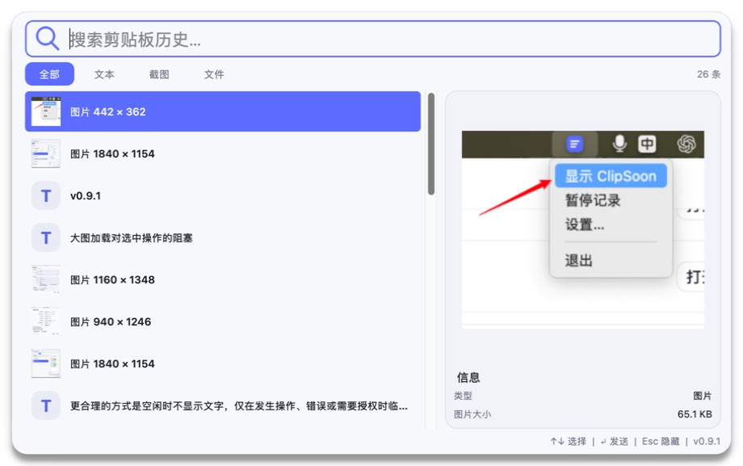
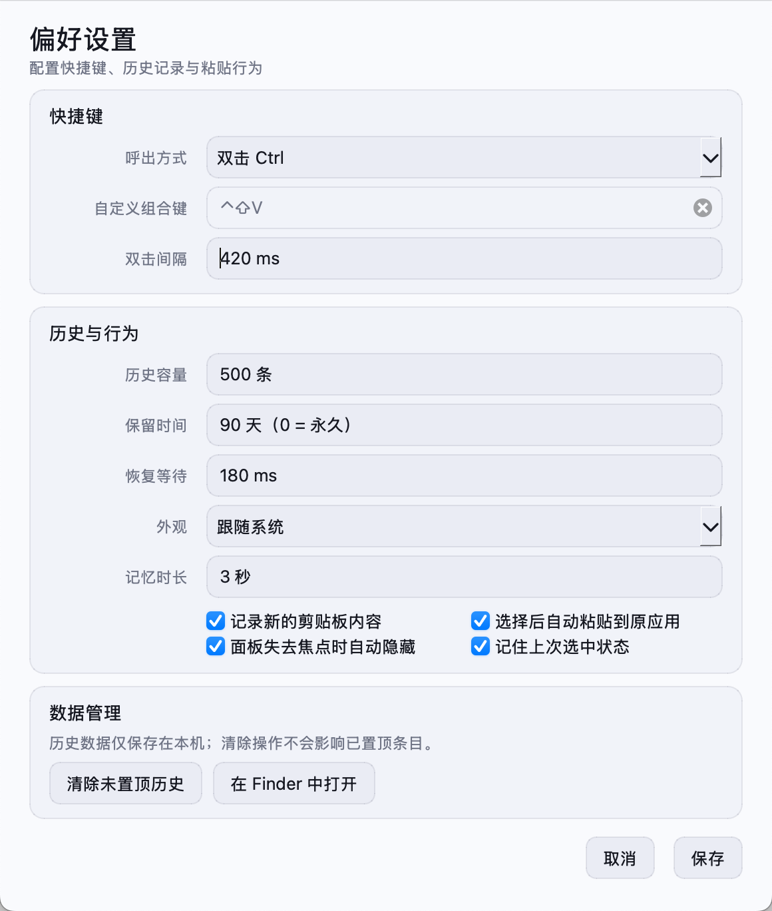

# ClipSoon

ClipSoon 是一款面向 macOS 和 Windows 的本地剪贴板历史工具。它像 Spotlight / Raycast 一样按需出现：复制内容后，通过全局快捷键呼出面板，搜索、预览并快速粘贴过去复制过的文本、图片或文件。

> 本地优先：历史数据仅保存在本机 SQLite 数据库和图片目录中，不上传网络。

## 界面预览

### 主窗口



### 设置窗口



## 功能特性

- 记录文本、图片和本地文件，相同内容再次复制时自动去重并提升到最近位置。
- 支持 Unicode 搜索、确定性匹配排序和“全部 / 文本 / 截图 / 文件”类型筛选。
- 紧凑单行列表，图片显示真实缩略图，右侧显示内容预览与类型信息；单个文本文件只读预览前 220 个字符，未完整展示时以 `...` 结尾。
- 图片缩略图和大图预览在后台加载，超大图片不会阻塞列表选中，已加载结果会缓存复用。
- 支持 Finder / 资源管理器式 `Shift`、`Ctrl` / `Command` 多选，以及右键删除或清空历史。
- 默认双击 `Ctrl` 呼出；可在设置中切换修饰键或录制自定义组合键。
- `Enter` 或双击列表项即可发送，`Esc` 或面板失去焦点后隐藏。
- 支持历史容量、保留天数、粘贴延迟、选择后自动粘贴与失焦隐藏等设置。
- 鼠标点击搜索框左侧的放大镜即可打开设置，系统托盘菜单也保留设置入口。
- 底部状态栏空闲时保持简洁，仅在操作反馈、错误或需要授权时显示信息。

## 快捷操作

| 操作 | 效果 |
| --- | --- |
| 双击 `Ctrl` | 呼出 ClipSoon（默认） |
| `↑` / `↓` | 移动当前选择 |
| `Shift` + `↑` / `↓` | 连续多选 |
| `Ctrl` / `Command` + 鼠标点击 | 切换单个列表项的选中状态 |
| `Tab` / `Shift` + `Tab` | 正向 / 反向循环切换类型筛选 |
| `Enter` | 将当前内容发送到原应用 |
| `Esc` | 隐藏面板 |
| 点击放大镜 | 打开设置 |

## 系统要求

- Python `3.12`（开发和打包环境统一，当前不支持 Python 3.13）。
- macOS 13 或更高版本。
- Windows 10 / 11。

### macOS 权限

全局按键监听和跨应用自动粘贴需要在“系统设置 → 隐私与安全性 → 辅助功能”中允许 Terminal 或打包后的 ClipSoon。应用只在未授权时显示提示，并可直达对应的系统设置页。

### Windows 权限

Windows 不需要开启 macOS 式的辅助功能权限。如果目标应用以管理员身份运行，ClipSoon 也需要以相同权限运行才能向其发送粘贴按键。

## 从源码运行

```bash
git clone git@github.com:Helchan/ClipSoon.git
cd ClipSoon
python3.12 -m venv .venv
.venv/bin/python -m pip install -e '.[dev,package]'
```

日常开发和功能验收应直接从当前源码启动，不需要先打包：

- macOS：双击 `run.command`。
- Windows：双击 `run.bat`。

两个入口会先关闭本项目的旧打包实例和旧源码实例，再使用当前 `.venv` 执行 `python -m clipsoon --show`，避免因为旧进程未退出而验证到过期代码。

## 测试

```bash
.venv/bin/ruff check .
QT_QPA_PLATFORM=offscreen .venv/bin/pytest -q
.venv/bin/coverage run -m pytest
.venv/bin/coverage report
```

## 打包

需要生成可分发产物时，使用仓库根目录下的平台脚本：

- macOS：双击 `build_macos.command`，产物为 `dist/ClipSoon.app`。
- Windows：双击 `build_windows.bat`，产物为 `dist\ClipSoon\ClipSoon.exe`。

Windows 包需要在 Windows 10 / 11 主机上生成。两个脚本都使用 PyInstaller one-dir，避免 one-file 每次启动时的临时解包开销。macOS 脚本会执行 ad-hoc 签名和严格签名校验；正式对外分发仍需要 Developer ID 签名与公证。

## 自动发布

推送 `v*` 版本标签后，[GitHub Actions](.github/workflows/release.yml) 会自动构建并发布：

- Windows x64：`ClipSoon-vX.Y.Z-windows-x64.zip`。
- macOS Apple Silicon（M1 / M2 / M3 / M4）：`ClipSoon-vX.Y.Z-macOS-arm64.zip`。
- 两个包的 SHA-256 校验文件：`SHA256SUMS.txt`。

发布前先将 `pyproject.toml` 和 `clipsoon/__init__.py` 中的版本保持一致，提交并推送到 `main`，然后执行：

```bash
git tag v0.9.1
git push origin v0.9.1
```

Release 会使用标签名生成说明并附加两个平台包。工作流使用 Windows x64 runner 和 macOS 15 ARM64 runner，并在发布前校验 Git 标签、运行时版本与项目版本一致。macOS 产物当前为 ad-hoc 签名，未使用 Developer ID 且未执行 Apple 公证。

## 项目结构

```text
clipsoon/
├── app.py       # 应用装配与生命周期
├── core.py      # 模型、设置与 SQLite 历史库
├── search.py    # Unicode 搜索与匹配排序
├── system.py    # 剪贴板、快捷键与平台边界
└── ui.py        # PySide6 界面
tests/            # 自动化测试
docs/             # 产品规格、架构、竞品调研和验收记录
```

## 文档

- [产品规格与验收](docs/产品规格与验收.md)
- [架构设计](docs/架构设计.md)
- [竞品调研](docs/竞品调研.md)
- [验收报告](docs/验收报告.md)

## 隐私

ClipSoon 的核心功能不发起网络请求。文本和文件记录保存在本机 SQLite 数据库中，图片以 PNG 文件保存在应用数据目录。你可随时在设置中暂停记录、打开数据目录或清空未置顶历史。
