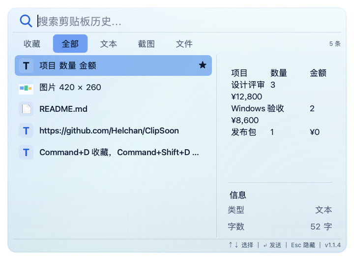
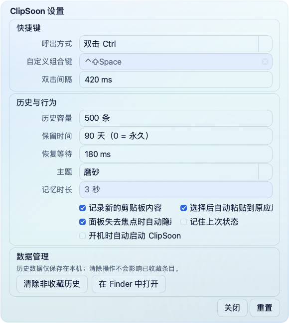

# ClipSoon

ClipSoon 是一款面向 macOS 和 Windows 的本地剪贴板历史工具。它像 Spotlight / Raycast 一样按需出现：复制内容后，通过全局快捷键呼出面板，搜索、预览并快速粘贴过去复制过的文本、图片或文件。

当前发布版本：`v1.1.7`。

> 本地优先：历史数据仅保存在本机 SQLite 数据库和图片目录中，不上传网络。

## 界面预览

### 主窗口



### 设置面板



## 功能特性

- 记录文本、图片和本地文件，相同内容再次复制时自动去重并提升到最近位置；从 Excel/WPS 等表格应用复制单个或多个单元格时，会按可搜索、可再次粘贴的文本历史保存，列以 Tab 分隔、行以换行分隔。
- 支持 Unicode 搜索、确定性匹配排序和“收藏 / 全部 / 文本 / 截图 / 文件”筛选，默认展示“全部”。
- macOS 保留精修后的 Spotlight/Raycast 风格尺度；Windows 使用单独的紧凑视觉指标，三个主题下都会收紧字号、行高、设置窗口、弹出层和主面板默认尺寸，避免在高 DPI 缩放下显得粗大。
- 紧凑单行列表，图片显示真实缩略图，右侧显示内容预览与类型信息；单个文本文件只读预览前 220 个字符，未完整展示时以 `...` 结尾。
- 图片缩略图和大图预览在后台加载，超大图片不会阻塞列表选中，已加载结果会缓存复用。
- 点击右侧图片预览会打开应用内无边框纯图片查看器，窗口按图片尺寸生成并受屏幕最大尺寸约束；按住 Control/Ctrl 滚轮缩放，默认指针下按住图片可连续拖动位置，单击图片、按 Esc 或点击主窗口区域关闭。
- 支持 Finder / 资源管理器式 `Shift`、`Ctrl` / `Command` 多选；按 `Enter` 时，多选文本先按当前列表从上到下合并为一个临时文本负载，项间写入一个平台换行。正常路径只执行一次剪贴板写入、一次目标恢复与校验；若粘贴前验证发现负载被覆盖，最多原样重写同一个完整负载一次，但无论是否重写都仅触发一次系统粘贴。Windows 使用 CRLF，其他平台使用 LF；原条目内容保持不变，最后一项后不额外添加换行，也不模拟可能触发聊天软件发送动作的 Enter。关闭“选择后自动粘贴”或没有原目标窗口时，同一个合并负载只复制一次。多条图片/文件历史记录或混合类型多选无法在通用剪贴板中无损表达为带换行的一次粘贴，因此会在写入前明确提示“图片或文件请单项发送”，不会退回逐项发送；单条文本、图片或文件记录仍照常发送，单条文件记录可继续包含多个路径。右键菜单提供带单色语义图标和右侧快捷键提示的“全选”“收藏”“取消收藏”“删除”“清空”“清空NF”“设置”：收藏状态不改变“全部”列表的最近排序，“收藏”Tab 单独展示收藏项；收藏、取消收藏和删除不会让列表跳回顶部，删除后自动接续选中下一项或上一项；“清空NF”清空全部非收藏历史并保留收藏项。菜单以紧凑的图标—文字间距和等值左右留白定宽，“设置”使用齿轮语义图标，清空确认采用与当前主题一致的应用内对话框。
- 主搜索框始终保持唯一输入焦点；选中文本或文本文件预览中的内容后，仍可用 `Command+C`（macOS）或 `Ctrl+C`（Windows）复制。预览右键菜单固定使用中文“复制”“全选”。
- macOS 默认双击 `Ctrl` 呼出；Windows 默认使用系统注册的 `Ctrl+Shift+Space`，可在设置中录制其他组合键。
- Windows 的热键与剪贴板读写分别运行在可自动恢复的原生子进程中；即使剪贴板所有者卡住，主界面和呼出热键也互不阻塞。
- `Enter` 将全部选中文本合并并只粘贴一次；单项文本、图片或文件照常发送，双击仍只发送点击项。`Esc` 或面板失去焦点后隐藏。Windows 首次从全局快捷键呼出时也能识别外部点击。
- 支持在设置中开启用户登录时自动启动；macOS 和 Windows 均使用当前用户级启动项，不需要管理员权限。
- 主窗口可从非文本的空白区域拖动，松开鼠标后自动保存位置，后续呼出保持在该位置；显示器布局变化时自动约束到可见屏幕。
- 支持历史容量、保留天数、粘贴延迟、选择后自动粘贴与失焦隐藏等设置；所有修改立即生效，设置采用无系统标题栏外壳，底部提供关闭与重置偏好，也可通过 `Esc` 或点击窗口外关闭。设置窗口打开期间，主面板会被模糊淡化到文字不可辨认，只保留大轮廓和色块，并停止响应搜索、列表、滚轮和右键操作。
- “磨砂”为默认主题，并与浅色、深色两种显式主题一同覆盖设置下拉列表、列表右键菜单等弹出组件，文字、悬停和选中状态均保持清晰对比。
- 主面板在三种主题下都提供沿圆角边缘内侧缓慢流动的青紫霓虹光带；光带会随面板尺寸动态保持约“两段水平边长加一段垂直边长”的弧长，而不是使用固定周长比例。“流动霓虹边框”默认开启，可在设置中即时关闭或重新开启并持久化，关闭后保留原有静态边界且不再运行刷新计时器。
- 磨砂使用一个固定浅色且不透明的应用内材质壳：环境色、双层折射感边缘、顶部高光和随指针移动的柔光共同构成效果，不会读取、截取或透出桌面内容，不跟随系统明暗，也不启用平台原生背景模糊；底部和右侧信息区保持浅亮可读，列表和详情保持为可读的功能层，避免层层玻璃卡片。
- “记住上次状态”默认关闭；启用后默认在面板隐藏后的 3 秒内恢复类型 Tab、搜索内容、多选集合和当前焦点项，超时后回到“全部”的完整列表顶部。
- 鼠标点击搜索框左侧的放大镜即可打开设置；主面板激活时，搜索框始终保持唯一输入焦点，点击列表、预览、分类或其它区域不会丢失光标；系统托盘菜单也保留设置入口。
- 底部状态栏空闲时保持简洁，仅在操作反馈、错误或需要授权时显示信息。

## 快捷操作

| 操作 | 效果 |
| --- | --- |
| 双击 `Ctrl` | macOS 呼出 ClipSoon（默认） |
| `Ctrl` + `Shift` + `Space` | Windows 呼出 ClipSoon（默认） |
| `↑` / `↓` | 移动当前选择 |
| `Shift` + `↑` / `↓` | 连续多选 |
| `Ctrl` / `Command` + 鼠标点击 | 切换单个列表项的选中状态 |
| `Command` / `Ctrl` + `A` | 全选当前 Tab 下的可见列表项 |
| `Command` / `Ctrl` + `D` | 收藏选中项 |
| `Command` / `Ctrl` + `Shift` + `D` | 取消收藏选中项 |
| `Command` + `Delete`（macOS）/ `Delete`（Windows） | 删除选中项 |
| `Command` / `Ctrl` + `Shift` + `Delete` | 清空当前 Tab 历史 |
| `Command` + `Option` + `N`（macOS）/ `Ctrl` + `Alt` + `N`（Windows） | 清空非收藏历史 |
| `Command` / `Ctrl` + `,` | 打开设置 |
| `Tab` / `Shift` + `Tab` | 正向 / 反向循环切换类型筛选 |
| `Enter` | 按列表顺序合并全部选中文本，项间换行并只发送一次 |
| `Esc` | 隐藏面板 |
| 点击放大镜 | 打开设置 |
| 拖动非文本空白区域 | 移动主窗口并记忆位置 |

## 系统要求

- Python `3.12`（开发和打包环境统一，当前不支持 Python 3.13）。
- macOS 13 或更高版本。
- Windows 10 / 11。

磨砂主题不依赖 macOS Tahoe、`NSVisualEffectView` 或 Windows DWM Desktop Acrylic。macOS、Windows 10/11 和 Linux 都使用同一套应用内浅色材质渲染，以保持跨平台一致。

### macOS 权限

全局按键监听和跨应用自动粘贴需要在“系统设置 → 隐私与安全性 → 辅助功能”中允许 Terminal 或打包后的 ClipSoon。应用只在未授权时显示提示，并可直达对应的系统设置页。

### Windows 权限

Windows 不需要开启 macOS 式的辅助功能权限。如果目标应用以管理员身份运行，ClipSoon 也需要以相同权限运行才能向其发送粘贴按键。

## 使用源码启动

日常开发和功能验收应直接从当前源码启动，不需要先打包。项目要求使用 Python 3.12，建议在仓库根目录创建项目专用的 `.venv`。

下面出现的 Python 命令不能跨平台混用：

- `python3.12` 是 macOS 安装 Python 3.12 后常见的命令名。
- `py -3.12` 是 Windows 的 Python Launcher 命令，用来明确选择已安装的 Python 3.12；如果系统中只有 `py` 而没有 `python` 或 `python3.12`，这是正常情况。
- 创建 `.venv` 后，安装依赖和启动源码都使用该虚拟环境里的 Python：macOS 为 `.venv/bin/python`，Windows 为 `.venv\Scripts\python.exe`。两者是平台相关路径，不可互换。

### macOS

首次克隆并安装开发依赖：

```bash
git clone git@github.com:Helchan/ClipSoon.git
cd ClipSoon
python3.12 -m venv .venv
.venv/bin/python -m pip install --upgrade pip
.venv/bin/python -m pip install -e '.[dev,package]'
```

以后可以双击仓库根目录的 `run.command`，也可以在终端运行：

```bash
./run.command
```

如果系统阻止执行，先运行一次：

```bash
chmod +x run.command scripts/run_macos.command
```

从 Terminal 或 PyCharm 启动源码时，全局按键监听和跨应用自动粘贴所需的辅助功能权限应授予实际启动 ClipSoon 的 Terminal 或 PyCharm。

### Windows

在 CMD 中首次安装开发依赖：

```bat
git clone git@github.com:Helchan/ClipSoon.git
cd ClipSoon
py -3.12 -m venv .venv
.venv\Scripts\python.exe -m pip install --upgrade pip
.venv\Scripts\python.exe -m pip install -e ".[dev,package]"
```

如果 PyCharm Terminal 使用 PowerShell，则虚拟环境中的可执行文件需要使用 `./` 对应的 Windows 写法 `.\`：

```powershell
git clone git@github.com:Helchan/ClipSoon.git
Set-Location ClipSoon
py -3.12 -m venv .venv
.\.venv\Scripts\python.exe -m pip install --upgrade pip
.\.venv\Scripts\python.exe -m pip install -e ".[dev,package]"
```

以后可以双击仓库根目录的 `run.bat`，也可以在 CMD 中运行：

```bat
run.bat
```

也可以不经过启动脚本，直接用虚拟环境里的 Python 启动当前源码：

```bat
.venv\Scripts\python.exe -m clipsoon --show
```

PowerShell 对应命令为：

```powershell
.\.venv\Scripts\python.exe -m clipsoon --show
```

如果 Windows 找不到 `py`，可将第一条创建环境的命令改为 Python 3.12 的实际安装路径，例如：

```bat
"C:\Program Files\Python312\python.exe" -m venv .venv
```

两个平台的启动入口都会先关闭本项目的旧打包实例和旧源码实例，再使用当前 `.venv` 执行 `python -m clipsoon --show`，避免因为旧进程未退出而验证到过期代码。不要在 PyCharm 断点调试期间再次运行启动脚本，否则脚本可能会结束正在调试的旧源码进程。

## 开发与断点调试

### PyCharm 项目解释器

用 PyCharm 打开仓库根目录，在 `Settings / Preferences → Project: ClipSoon → Python Interpreter` 中添加已有的本地解释器：

- macOS：`<项目目录>/.venv/bin/python`
- Windows：`<项目目录>\.venv\Scripts\python.exe`

不要选择系统 Python 或其他项目的虚拟环境。

### PyCharm 启动配置

在 `Run → Edit Configurations` 中新增 Python 配置：

| 配置项 | 值 |
| --- | --- |
| Name | `ClipSoon Debug` |
| Run | `Module name` |
| Module name | `clipsoon` |
| Parameters | `--show` |
| Working directory | 仓库根目录 |
| Python interpreter | 当前项目的 `.venv` |

建议在 `Environment variables` 中为调试实例设置独立数据目录，避免调试数据与正式使用的数据混在一起：

- macOS：`CLIPSOON_DATA_DIR=/Users/<用户名>/Library/Application Support/ClipSoon-dev`
- Windows：`CLIPSOON_DATA_DIR=C:\Users\<用户名>\AppData\Local\ClipSoon-dev`

配置完成后使用 PyCharm 的 Debug 启动并设置断点。常用调试入口：

- `clipsoon/app.py`：应用启动、窗口显示、设置和生命周期。
- `clipsoon/system.py`：剪贴板监听、全局快捷键和自动粘贴。
- `clipsoon/core.py`：设置、历史模型和 SQLite 数据。
- `clipsoon/search.py`：搜索与匹配排序。
- `clipsoon/ui.py`：窗口、列表、预览和设置界面。

ClipSoon 是系统托盘常驻应用，主窗口隐藏不代表进程退出。如果启动立即返回退出码 `2`，通常表示已有实例持有单实例锁；先从托盘退出旧实例，再重新调试。应用日志位于所用数据目录下的 `logs/clipsoon.log`，原生崩溃栈写入同目录的 `native-crash.log`。Windows 的 `run.bat` 在异常退出时会同时显示退出码和这两个日志位置。

Windows 空闲时会看到三个同源进程：一个 ClipSoon 主界面、一个原生热键宿主和一个原生剪贴板宿主。Windows 呼出快捷键只使用系统 `RegisterHotKey`；不再安装 Raw Input、低级键盘钩子或物理按键轮询器。旧版保存的双 Ctrl/Shift/Alt/Win 配置以及 Win32 不支持的组合键会在首次启动时迁移为 `Ctrl+Shift+Space` 并明确提示，之后可在设置中录制其他组合键；保存前会校验键位能否由 Win32 注册。若新组合键已被其他程序占用，ClipSoon 会自动恢复并重新注册上一个可用快捷键；启动时自定义组合键被占用且尚无已确认配置时会改用默认组合键，默认组合键也被占用时则保留托盘运行并明确报错，不会循环重启宿主。热键宿主会在触发瞬间记录原目标顶层窗口和实际输入焦点的 HWND/TID/PID，并尝试把前台激活许可交给主进程；发送时会校验句柄身份。若普通恢复不足，ClipSoon 按需启动一个一次性焦点 helper，在该短生命进程内临时附加当前前台、目标和焦点输入线程，执行并复核 `SetForegroundWindow + SetFocus` 后立即退出；Qt 主线程永不调用 `AttachThreadInput`，解绑异常也由 helper 进程退出兜底，不会污染后续快捷键或焦点。桌面客户端异步重建输入控件时会有界等待并再次核验实际前台焦点。Windows 的窗口失焦隐藏只由原生前台窗口监测负责，不再与 Qt 的通用失焦定时器竞争。

剪贴板宿主是 Windows 剪贴板的唯一读写者，主界面既不调用 Qt MIME 读取，也不通过 Qt/OLE 写入。发送文本时原生写入 `CF_UNICODETEXT`，文件写入 `CF_HDROP + Preferred DropEffect(COPY)`，图片同时 eager 写入 `PNG + CF_DIBV5 + CF_DIB`；所有格式都先用 `GHND` 分配可移动且清零的 `HGLOBAL`，再以非空句柄一次性提交，避免依赖拥有者进程存活的延迟渲染或目标客户端临时合成格式。三格式位图原始像素限制为 128 MiB，避免超大截图在 GUI 与 helper 中造成无界峰值。宿主只有在关闭剪贴板、sequence 相对写入前已推进，且 owner/内部 request marker/必需格式全部验证后才返回 ACK；主界面收到 ACK 前不会隐藏、激活目标或发送 `Ctrl+V`。桌面客户端读取兼容格式导致 sequence 合法变化时，粘贴前会在实际稳定 sequence 上重新核对同一 owner/marker/formats，不会误判为外部覆盖；真正被其他程序改写仍会失败并最多完整重写一次。Windows 的 `Ctrl+V` 由一次原生 `SendInput` 批量提交，四个事件全部进入系统时提示“已触发粘贴”，否则保留剪贴板并提示自动粘贴失败；是否被 WeLink 实际消费仍以输入框内容出现为准。

剪贴板变化的采集仍由同一宿主隔离处理；ClipSoon 自身写回带内部标记，监听端不会再次读取整张图片。若外部应用的延迟渲染让原生读取卡住，用户发起发送时会优先替换宿主并以稳定 request ID 在新 session 重试。两个宿主每 500 ms 发送心跳，卡死、退出或父进程消失时会被自动替换或清理；大图在关闭系统剪贴板后继续转换落盘，重启宿主时自动回收无主临时文件。标签构建的 Windows 冻结包会实际写入文本、文件和图片，并在剪贴板宿主退出后再次读取 PNG/DIB 格式，验证 eager 数据生命周期；还会以冻结 EXE 跨进程发送 `Ctrl+V`，要求文本进入目标 EDIT、图片触发目标 `WM_PASTE` 且三种图片格式均可读。具体聊天客户端仍属于 Windows 真机验收项。错误统一写入主数据目录下的 `clipsoon.log`。

文件历史只保存原路径，不复制源文件。应用启动、面板呼出以及后台每 3 秒都会异步检查文件记录；多文件记录中任一路径确定不存在时会移除整条记录。扫描结果通过记录 revision 做比较并删除，扫描期间重新复制或更新的同一条记录不会被旧结果误删。发送前也会由有并发上限的后台守护工作线程复核仓库中的最新项，避免网络盘检查卡住界面；只有对应卷、UNC 共享或映射盘根目录仍可访问时，子路径不存在才会被确认删除，权限拒绝、断开的共享、拔出的移动盘等不确定状态都会保留历史。

在 PyCharm 中调试主进程时，热键和剪贴板两个常驻 helper 以及按需启动的一次性焦点/粘贴 helper 都是独立子进程，主进程断点不会自动附加到子进程；原生边界可直接运行 `tests/test_windows_hotkey_host.py`、`tests/test_windows_clipboard_host.py`、`tests/test_windows_focus_host.py`、`tests/test_windows_paste_host.py` 和 `tests/test_windows_workers.py`。若使用独立 `CLIPSOON_DATA_DIR` 同时启动正式版与调试版，当前 Windows 会话只允许一个热键宿主持有全局热键，后启动的实例会明确提示占用，不会重复呼出两个窗口。

“登录时自动启动”会记录当前运行形态的启动命令：打包应用记录 ClipSoon 可执行文件，源码环境记录当前 `.venv` 中的 Python。源码环境启用后不要移动或删除该虚拟环境；如需变更项目位置，移动后手动启动一次 ClipSoon 并在设置中重新保存该选项。

## 测试

macOS：

```bash
.venv/bin/ruff check .
QT_QPA_PLATFORM=offscreen .venv/bin/pytest -q
.venv/bin/coverage run -m pytest
.venv/bin/coverage report
```

Windows CMD：

```bat
.venv\Scripts\python.exe -m ruff check .
set QT_QPA_PLATFORM=offscreen
.venv\Scripts\python.exe -m pytest -q
.venv\Scripts\python.exe -m coverage run -m pytest
.venv\Scripts\python.exe -m coverage report
```

Windows PowerShell：

```powershell
.\.venv\Scripts\python.exe -m ruff check .
$env:QT_QPA_PLATFORM = "offscreen"
.\.venv\Scripts\python.exe -m pytest -q
.\.venv\Scripts\python.exe -m coverage run -m pytest
.\.venv\Scripts\python.exe -m coverage report
```

也可以在 PyCharm 中右键 `tests` 目录运行 pytest；对应测试配置应设置环境变量 `QT_QPA_PLATFORM=offscreen`。

## 打包

需要生成可分发产物时，使用仓库根目录下的平台脚本：

- macOS：双击 `build_macos.command`，产物为 `dist/ClipSoon.app`。
- Windows：双击 `build_windows.bat`，产物为 `dist\ClipSoon\ClipSoon.exe` 所在的完整便携目录。

Windows 包需要在 Windows 10 / 11 主机上生成。默认 Windows 包使用 PyInstaller one-dir，避免 one-file 每次启动时的临时解包开销。它不是一个可以单独拷走的裸 exe：运行时必须保留整个 `dist\ClipSoon` 目录，因为 `ClipSoon.exe` 依赖旁边的 `_internal\python312.dll`、Qt DLL 和其他运行库。发布页下载的 `ClipSoon-vX.Y.Z-windows-x64.zip` 也需要先完整解压，再运行解压后目录里的 `ClipSoon\ClipSoon.exe`；不要直接在 zip 预览窗口里双击 exe，也不要只把 exe 拖到桌面。需要放到桌面时，应创建快捷方式。

如果确实需要单文件 exe，可在 Windows 上运行：

```bat
build_windows.bat onefile
```

该模式产物为 `dist\ClipSoon.exe`，但启动会因为临时解包更慢，且当前正式发布工作流仍使用默认 one-dir 便携目录包。macOS 脚本会执行 ad-hoc 签名和严格签名校验；正式对外分发仍需要 Developer ID 签名与公证。

## 自动发布

推送 `v*` 版本标签后，[GitHub Actions](.github/workflows/release.yml) 会自动构建并发布：

- Windows x64：`ClipSoon-vX.Y.Z-windows-x64.zip`。
- macOS Apple Silicon（M1 / M2 / M3 / M4）：`ClipSoon-vX.Y.Z-macOS-arm64.zip`。
- 两个包的 SHA-256 校验文件：`SHA256SUMS.txt`。

发布前先将 `pyproject.toml` 和 `clipsoon/__init__.py` 中的版本保持一致，提交并推送到 `main`，然后执行：

```bash
git tag -a v1.1.7 -m "ClipSoon 1.1.7"
git push origin v1.1.7
```

Release 会使用标签名生成说明并附加两个平台包。工作流使用 Windows x64 runner 和 macOS 15 ARM64 runner，并在发布前校验 Git 标签、运行时版本与项目版本一致。macOS 产物当前为 ad-hoc 签名，未使用 Developer ID 且未执行 Apple 公证。

## 项目结构

```text
clipsoon/
├── launcher.py               # 轻量进程入口，先分派 Windows helper
├── app.py                    # 应用装配与生命周期
├── core.py                   # 模型、设置与 SQLite 历史库
├── search.py                 # Unicode 搜索与匹配排序
├── system.py                 # 主进程平台适配、发送与 manifest 入库
├── windows_workers.py        # Windows helper 监督、心跳与协议校验
├── windows_hotkey_host.py    # RegisterHotKey 原生宿主
├── windows_clipboard_host.py # Win32 clipboard 原生宿主
├── windows_focus_host.py     # 一次性前台/焦点恢复边界
├── windows_paste_host.py     # 共享 SendInput 实现与冻结包探针入口
└── ui.py                     # PySide6 界面
tests/            # 自动化测试
docs/             # 产品规格、架构、竞品调研和验收记录
```

## 文档

- [产品规格与验收](docs/产品规格与验收.md)
- [架构设计](docs/架构设计.md)
- [竞品调研](docs/竞品调研.md)
- [验收报告](docs/验收报告.md)

## 隐私

ClipSoon 的核心功能不发起网络请求。文本和文件记录保存在本机 SQLite 数据库中，图片以 PNG 文件保存在应用数据目录。你可随时在设置中暂停记录、打开数据目录或清空非收藏历史。
